# 💈 BarberBook

**A full-stack unisex barber & salon booking marketplace app** — connecting customers with nearby barbershops and parlours for real-time appointment booking, and giving shop owners a complete dashboard to manage their business.

Built end-to-end (mobile app + backend API) as a solo developer project, from architecture and database design through to a polished, production-style UI.


---

## 📱 Screenshots

### Authentication
<table>
  <tr>
    <td align="center">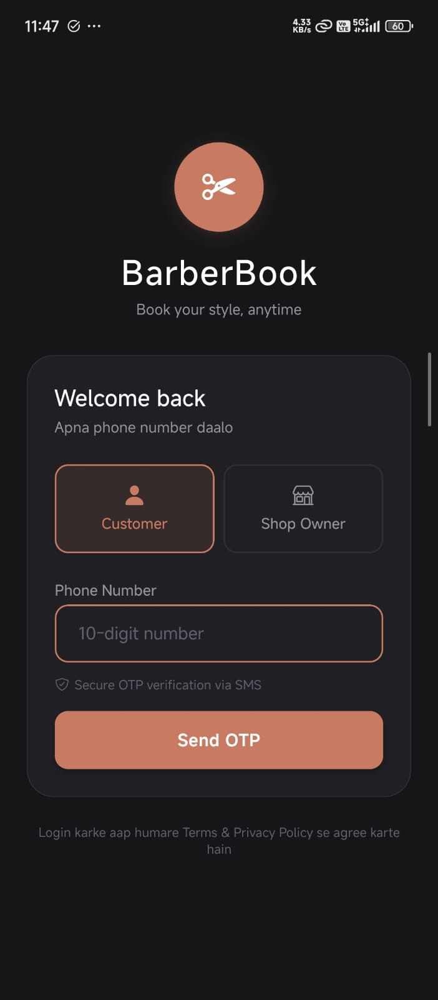<br/><sub>Login — Role Selector</sub></td>
    <td align="center">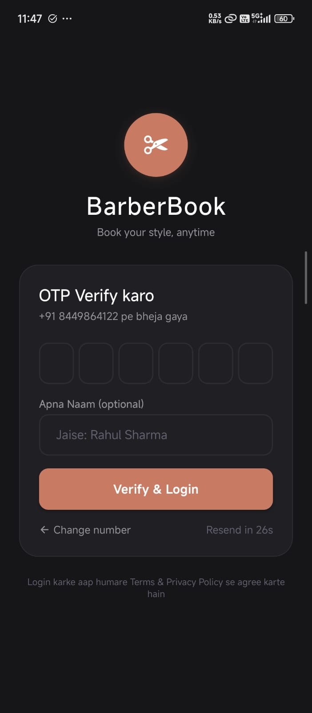<br/><sub>OTP Verification</sub></td>
  </tr>
</table>

### Customer Experience
<table>
  <tr>
    <td align="center">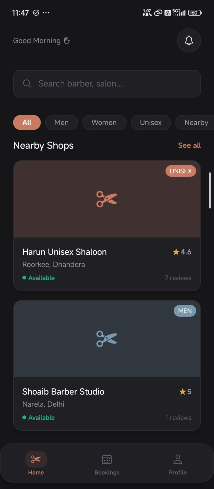<br/><sub>Home — Nearby Shops</sub></td>
    <td align="center">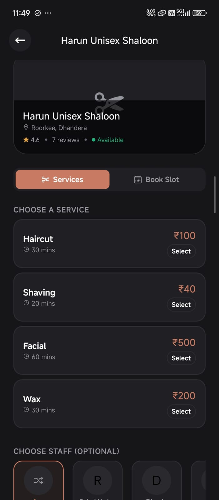<br/><sub>Shop — Services & Staff</sub></td>
    <td align="center">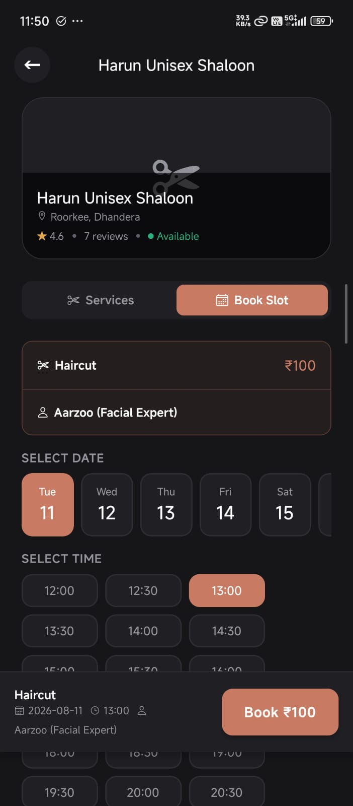<br/><sub>Shop — Slot Booking</sub></td>
  </tr>
  <tr>
    <td align="center">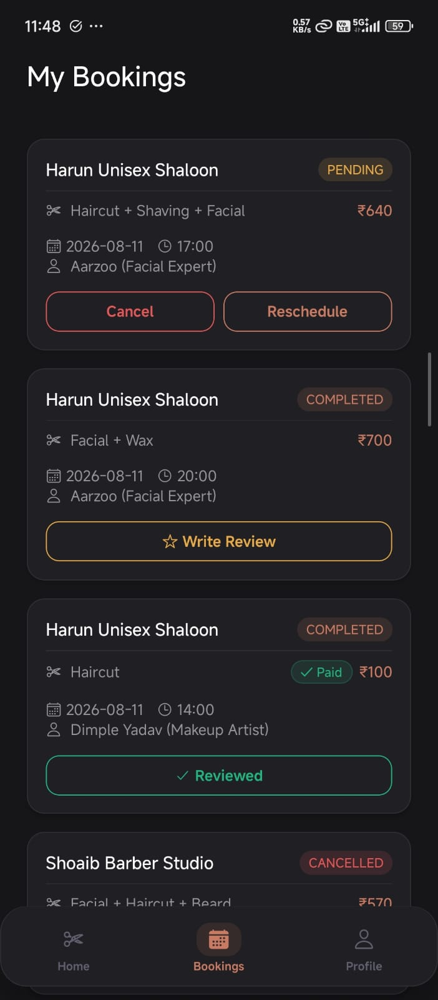<br/><sub>My Bookings</sub></td>
    <td align="center">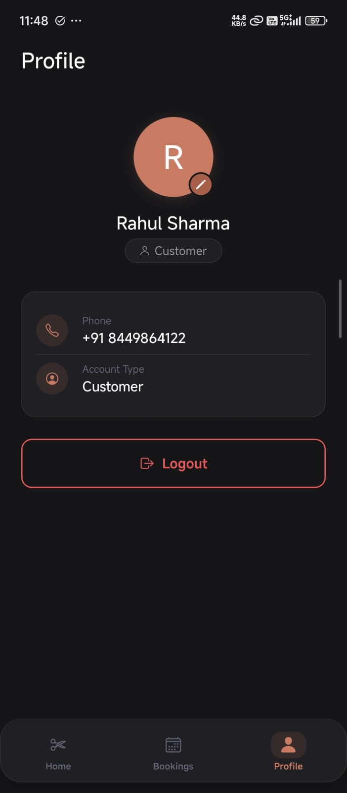<br/><sub>Profile</sub></td>
    <td></td>
  </tr>
</table>

### Shop Owner Dashboard
<table>
  <tr>
    <td align="center">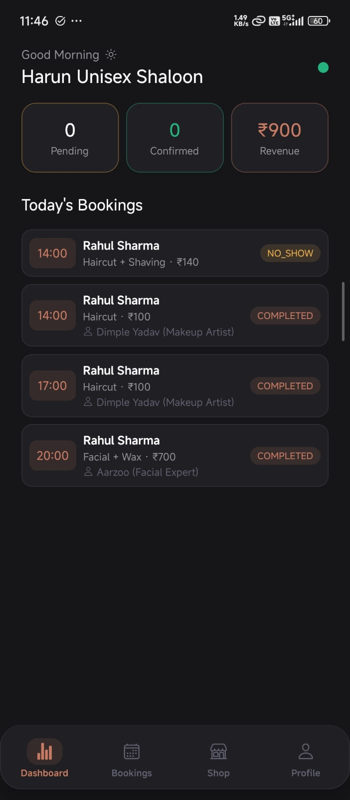<br/><sub>Owner Dashboard</sub></td>
    <td align="center">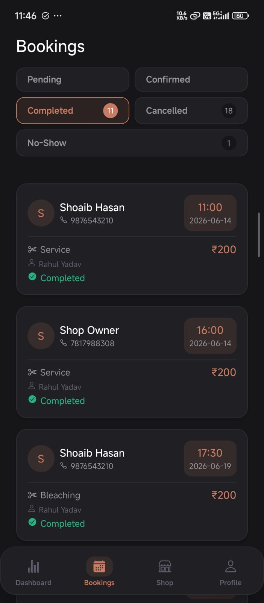<br/><sub>Booking Management</sub></td>
    <td align="center">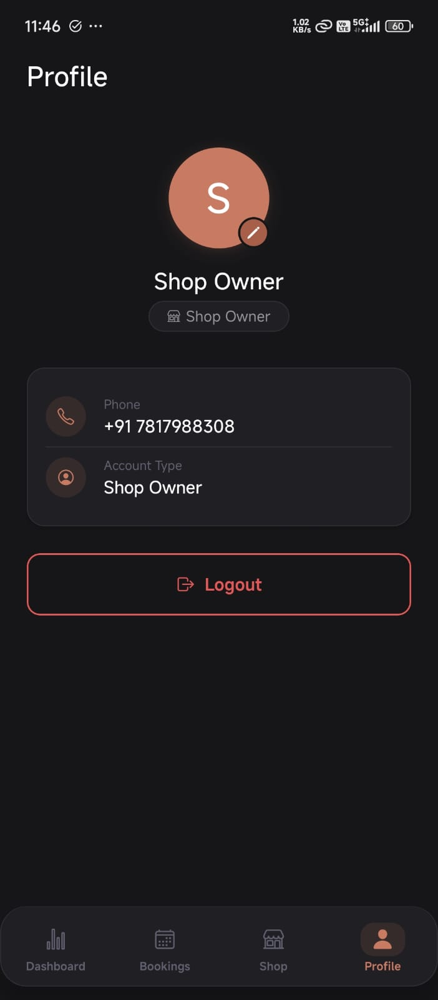<br/><sub>Owner Profile</sub></td>
  </tr>
  <tr>
    <td align="center">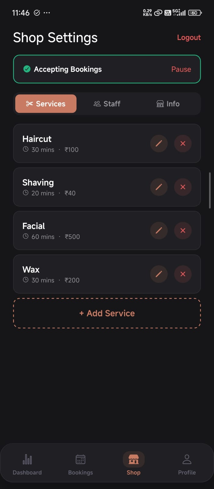<br/><sub>Shop Settings — Services</sub></td>
    <td align="center">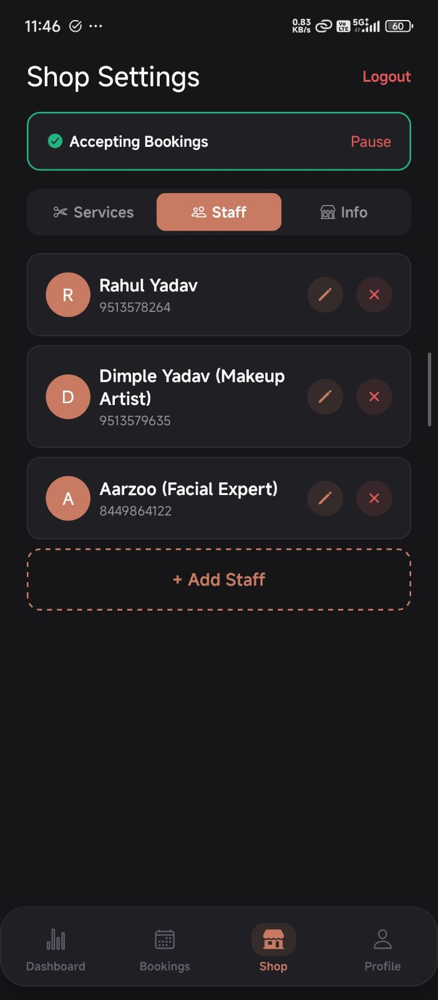<br/><sub>Shop Settings — Staff</sub></td>
    <td align="center">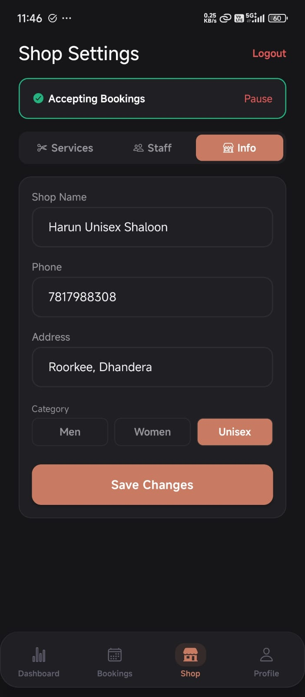<br/><sub>Shop Settings — Info</sub></td>
  </tr>
</table>

---

## ✨ Key Features

### For Customers
- 📍 **Location-aware discovery** — browse nearby men's, women's, and unisex shops with GPS-based distance sorting
- 🔍 **Search & category filters** — find shops by name, address, or category
- 🧾 **Multi-service booking** — select multiple services, an optional preferred staff member, and an available time slot in one flow
- 💳 **In-app payments** — integrated Razorpay checkout with signature verification, or pay-at-shop option
- 📅 **Booking management** — view upcoming/past bookings, cancel or reschedule directly from the app
- ⭐ **Reviews & ratings** — rate completed bookings to help other customers
- 🔔 **Real-time push notifications** — booking confirmations, cancellations, and status updates via Firebase FCM

### For Shop Owners
- 📊 **Live dashboard** — today's bookings, pending/confirmed counts, and daily revenue at a glance
- ✅ **Booking workflow management** — accept, complete, cancel, or mark a booking as a no-show, with dedicated filtered views for each status
- 🛠️ **Shop configuration** — manage services (pricing & duration), staff members, and shop info (address, category, accepting-bookings toggle) from one screen
- 🔐 **Secure, isolated multi-shop support** — each owner's data and push notifications are scoped strictly to their own shop

---

## 🏗️ Architecture & Tech Stack

The system is split into two independently deployed services:

```
┌─────────────────────┐         REST API          ┌──────────────────────┐
│   React Native App   │ ────────────────────────> │   Node.js / Express    │
│   (Expo, this repo)  │ <──────────────────────── │       Backend API      │
└─────────────────────┘                            └───────────┬──────────┘
                                                                 │
                          ┌──────────────────┐        ┌─────────┴─────────┐
                          │   Firebase FCM     │        │   MongoDB Atlas    │
                          │  (push notifs)     │        │   (data layer)     │
                          └──────────────────┘        └───────────────────┘
                                     ▲
                          ┌──────────┴──────────┐
                          │      Razorpay        │
                          │  (payment gateway)    │
                          └──────────────────────┘
```

**Frontend (this repo)**
- **React Native** + **Expo SDK 53** — cross-platform mobile app
- **React Navigation** — stack + bottom-tab navigation, with separate customer and owner tab flows under one auth-aware navigator
- Centralized design-token theme system (`constants/theme.js`) driving colors, spacing, radius, typography, and shadows across every screen — no hardcoded styling
- `@expo/vector-icons` (Ionicons) for a fully icon-based UI
- `expo-notifications` + `expo-device` for push notification registration
- `expo-location` for GPS-based nearby shop discovery, with graceful fallback handling
- Reusable component library (`Button`, `Card`, `Input`) shared across all screens
- EAS Build for generating installable Android APKs (development & standalone builds)

**Backend** *(private repository — architecture summarized here)*
- **Node.js** + **Express** REST API
- **MongoDB Atlas** for data persistence (users, shops, services, staff, bookings)
- **JWT-based authentication** with phone number + OTP verification flow (no passwords — merged register/login UX, consistent with modern consumer apps)
- **Razorpay** integration for order creation and HMAC-SHA256 payment signature verification
- **Firebase Cloud Messaging (FCM v1)** for server-triggered push notifications on booking events, with per-device token scoping to prevent cross-account notification leaks
- Timezone-safe (IST) slot-availability and booking-conflict logic
- Deployed on **Render**

---

## 📂 Project Structure (Frontend)

```
barber-app-frontend/
├── src/
│   ├── components/       # Shared UI components (Button, Card, Input)
│   ├── constants/        # Centralized theme (colors, spacing, radius, shadows)
│   ├── context/          # Auth context & session management
│   ├── navigation/        # Stack + bottom-tab navigators (customer & owner)
│   ├── screens/
│   │   ├── owner/         # Owner dashboard, bookings, shop settings
│   │   └── ...            # Home, ShopDetail, Booking, Login, Profile
│   └── services/          # API client, push notification setup
├── App.js
└── app.json
```

---

## 🧠 Engineering Highlights

- **Design system discipline** — every screen consumes a single source-of-truth theme file; a full visual rebrand (palette, spacing, iconography) was executed app-wide by editing one file plus targeted component updates, with zero hardcoded styling to hunt down.
- **Defensive UX patterns** — GPS failures degrade gracefully to a default location instead of blocking shop data from loading; async handlers are wrapped in try/catch to avoid silent failures and unhandled promise rejections in production.
- **Thoughtful state-driven UI** — sticky/floating action bars, live filter counts, and status-aware action sets (e.g. a booking's available actions change contextually based on its current status) rather than static, one-size-fits-all UI.
- **Security-conscious defaults** — payment signatures are verified server-side, FCM tokens are cleared on logout to prevent cross-account notification bleed, and no secrets are ever bundled into the client.

---

## 🚀 Getting Started

```bash
git clone https://github.com/soaebhasan12/barber-app-frontend.git
cd barber-app-frontend
npm install
npx expo start --dev-client
```

> Requires a running instance of the [backend API](#) and a configured `.env` with the relevant service keys (Razorpay, Firebase). The backend repository is private — reach out via the contact details below for a walkthrough or demo.

---

## 👤 Author

**Soaeb Hasan**

- 📧 [hasan.soaeb.ali@gmail.com](mailto:hasan.soaeb.ali@gmail.com)
- 💼 [LinkedIn](https://www.linkedin.com/in/soaeb-hasan-a590a3318)
- 🐙 [GitHub](https://github.com/soaebhasan12)
- 🌐 [Portfolio](https://soaebhasan04.pythonanywhere.com/)

---

<p align="center"><sub>Built solo, end-to-end — from database schema to pixel-level UI polish.</sub></p>
